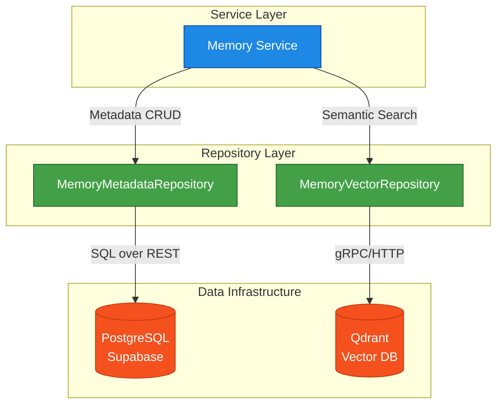

# Repository Architecture

BizOS employs a layered repository pattern to enforce strict separation of concerns between data storage mechanisms, ensuring business logic remains independent of persistence strategies.

## Overview

Repositories in BizOS act as the sole boundary between application logic (Services) and database infrastructure (PostgreSQL, Qdrant). A repository exposes atomic, domain-centric operations and completely hides database-specific logic, queries, and SDK details.

### Core Principles

1. **Atomic Operations**: Repository methods execute single, well-defined persistence operations (e.g., `create`, `soft_delete`, `get_by_id`, `update_summary`). Complex workflows and multi-step transactions belong in the Service Layer.
2. **Infrastructure Agnostic Contracts**: Services interact with repositories through abstract base classes (`AbstractMemoryRepository`, `AbstractVectorRepository`).
3. **No Business Logic**: Repositories must not calculate significance, manage embedding generation, or enforce domain rules.
4. **Exception Translation**: Raw database exceptions (e.g., Supabase PostgREST errors, Qdrant SDK errors) are caught and re-raised as standardized domain exceptions (e.g., `MemoryNotFoundError`, `DuplicateMemoryError`, `RepositoryError`).

## Separation of Concerns

The Memory Engine splits persistence across two dedicated repositories:

### 1. MemoryMetadataRepository (PostgreSQL)

**Responsibility**: Manages all structured, relational metadata and lifecycle state.
**Implementation**: Uses the `supabase` Python SDK.
**Data Handled**:
- Identity (`id`, `twin_id`)
- Classification (`memory_category`, `source`)
- Lifecycle (`created_at`, `deleted_at`, `embedding_status`)
- Raw text (`content`, `summary`)

### 2. MemoryVectorRepository (Qdrant)

**Responsibility**: Manages high-dimensional vector embeddings for semantic search.
**Implementation**: Uses the `qdrant-client` Python SDK.
**Data Handled**:
- The vector array (e.g., 768 dimensions)
- Minimal payload required for filtering (`twin_id`, `category`, `importance`)

## Repository Interaction Diagram

## Why Orchestration Belongs in the Service Layer

To ensure data integrity, creating a memory requires dual writes (Postgres + Qdrant) alongside intermediate steps like AI summarization or embedding generation. 

If a repository managed this, it would become tightly coupled to external models and multiple databases, violating the Single Responsibility Principle. By keeping repositories atomic, the **Memory Service** acts as the orchestrator, gracefully handling transactions, fallbacks, and compensating actions (e.g., rolling back Postgres if Qdrant insertion fails).
