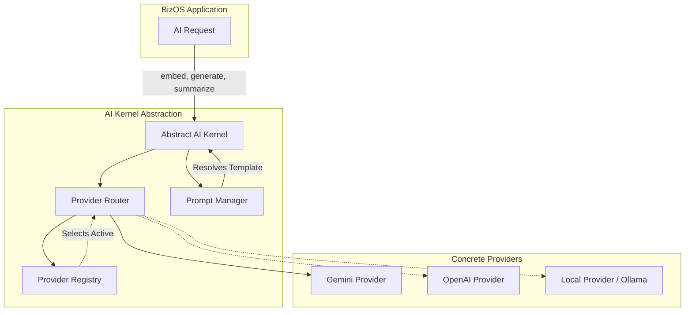

```mermaid
graph TD
    subgraph "BizOS Application"
        Request[AI Request]
    end

    subgraph "AI Kernel Abstraction"
        Kernel[Abstract AI Kernel]
        Router[Provider Router]
        Prompts[Prompt Manager]
        Registry[Provider Registry]
    end

    subgraph "Concrete Providers"
        Gemini[Gemini Provider]
        OpenAI[OpenAI Provider]
        Local[Local Provider / Ollama]
    end

    Request -->|embed, generate, summarize| Kernel
    Kernel --> Router
    Kernel --> Prompts
    Prompts -->|Resolves Template| Kernel
    Router --> Registry
    Registry -.->|Selects Active| Router
    Router --> Gemini
    Router -.-> OpenAI
    Router -.-> Local
```
