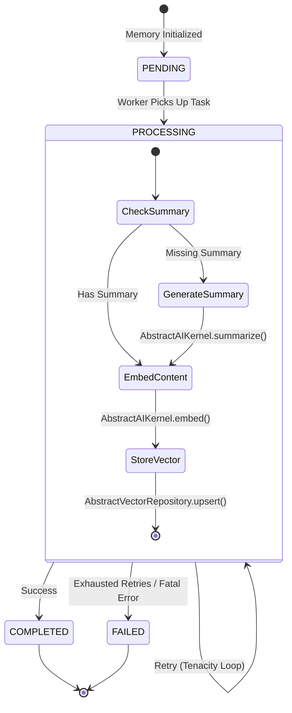

```mermaid
stateDiagram-v2
    [*] --> PENDING: Memory Initialized
    
    PENDING --> PROCESSING: Worker Picks Up Task
    
    state PROCESSING {
        [*] --> CheckSummary
        CheckSummary --> GenerateSummary: Missing Summary
        CheckSummary --> EmbedContent: Has Summary
        GenerateSummary --> EmbedContent: AbstractAIKernel.summarize()
        EmbedContent --> StoreVector: AbstractAIKernel.embed()
        StoreVector --> [*]: AbstractVectorRepository.upsert()
    }
    
    PROCESSING --> COMPLETED: Success
    PROCESSING --> PROCESSING: Retry (Tenacity Loop)
    PROCESSING --> FAILED: Exhausted Retries / Fatal Error
    
    COMPLETED --> [*]
    FAILED --> [*]
```
