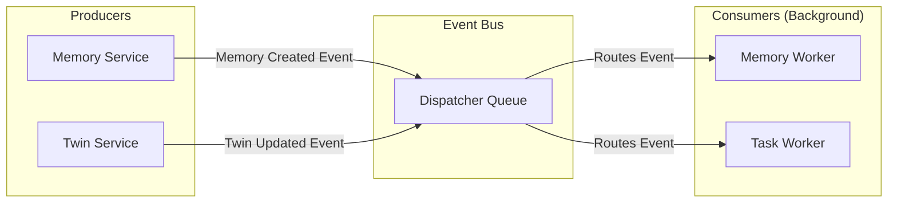

```mermaid
graph LR
    subgraph "Producers"
        MemService[Memory Service]
        TwinService[Twin Service]
    end

    subgraph "Event Bus"
        Dispatcher[Dispatcher Queue]
    end

    subgraph "Consumers (Background)"
        MemWorker[Memory Worker]
        TaskWorker[Task Worker]
    end

    MemService -->|Memory Created Event| Dispatcher
    TwinService -->|Twin Updated Event| Dispatcher

    Dispatcher -->|Routes Event| MemWorker
    Dispatcher -->|Routes Event| TaskWorker
```
