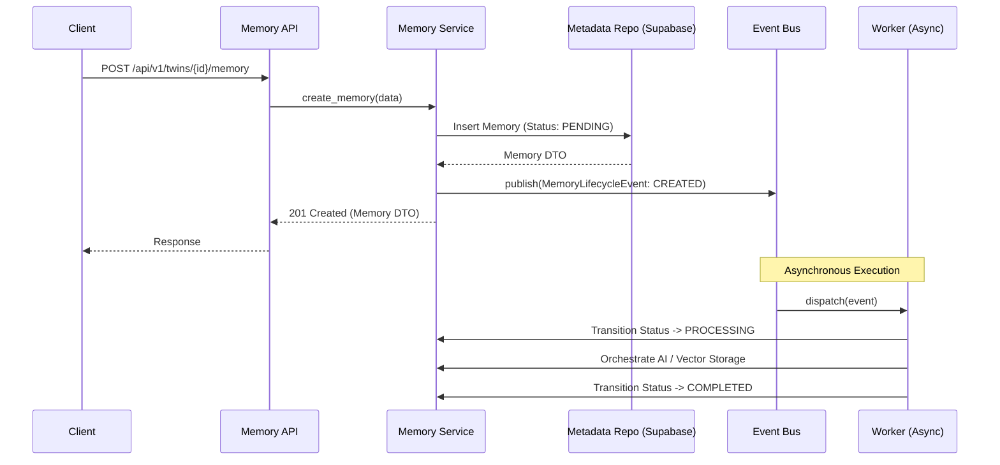

```mermaid
sequenceDiagram
    participant C as Client
    participant API as Memory API
    participant MS as Memory Service
    participant DB as Metadata Repo (Supabase)
    participant Bus as Event Bus
    participant W as Worker (Async)

    C->>API: POST /api/v1/twins/{id}/memory
    API->>MS: create_memory(data)
    MS->>DB: Insert Memory (Status: PENDING)
    DB-->>MS: Memory DTO
    MS->>Bus: publish(MemoryLifecycleEvent: CREATED)
    MS-->>API: 201 Created (Memory DTO)
    API-->>C: Response

    Note over Bus, W: Asynchronous Execution
    Bus->>W: dispatch(event)
    W->>MS: Transition Status -> PROCESSING
    W->>MS: Orchestrate AI / Vector Storage
    W->>MS: Transition Status -> COMPLETED
```
