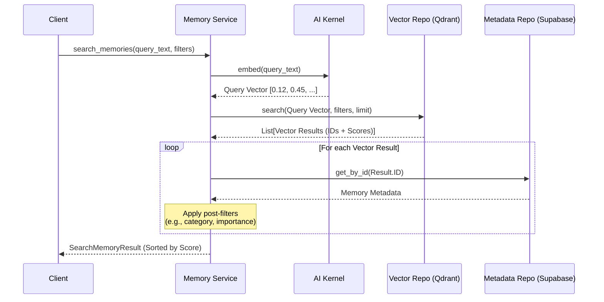

```mermaid
sequenceDiagram
    participant Client
    participant Service as Memory Service
    participant AI as AI Kernel
    participant Vec as Vector Repo (Qdrant)
    participant Meta as Metadata Repo (Supabase)

    Client->>Service: search_memories(query_text, filters)
    
    Service->>AI: embed(query_text)
    AI-->>Service: Query Vector [0.12, 0.45, ...]
    
    Service->>Vec: search(Query Vector, filters, limit)
    Vec-->>Service: List[Vector Results (IDs + Scores)]
    
    loop For each Vector Result
        Service->>Meta: get_by_id(Result.ID)
        Meta-->>Service: Memory Metadata
        Note over Service: Apply post-filters<br/>(e.g., category, importance)
    end
    
    Service-->>Client: SearchMemoryResult (Sorted by Score)
```
