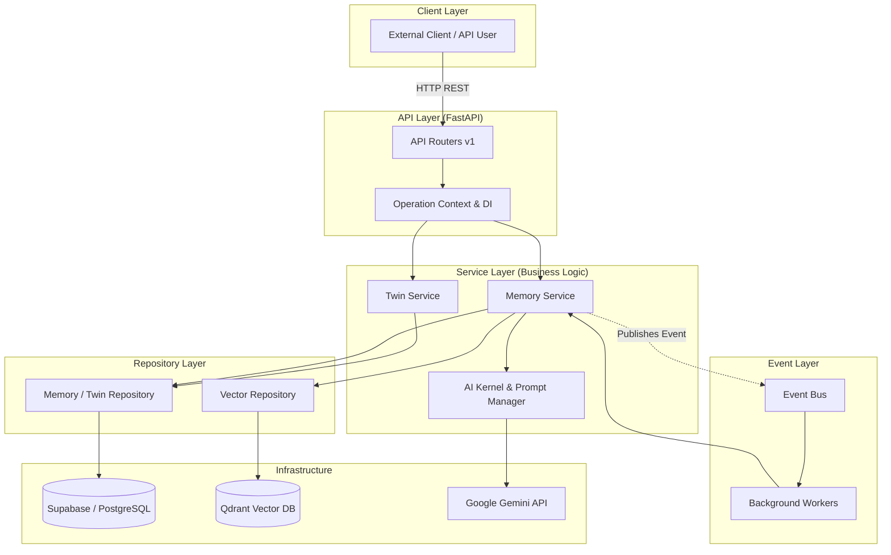

```mermaid
graph TD
    subgraph "Client Layer"
        Client[External Client / API User]
    end

    subgraph "API Layer (FastAPI)"
        Router[API Routers v1]
        Context[Operation Context & DI]
    end

    subgraph "Service Layer (Business Logic)"
        TwinSvc[Twin Service]
        MemSvc[Memory Service]
        AISvc[AI Kernel & Prompt Manager]
    end

    subgraph "Event Layer"
        Bus[Event Bus]
        Worker[Background Workers]
    end

    subgraph "Repository Layer"
        MetaRepo[Memory / Twin Repository]
        VecRepo[Vector Repository]
    end

    subgraph "Infrastructure"
        DB[(Supabase / PostgreSQL)]
        Qdrant[(Qdrant Vector DB)]
        Gemini[Google Gemini API]
    end

    Client -->|HTTP REST| Router
    Router --> Context
    Context --> TwinSvc
    Context --> MemSvc

    TwinSvc --> MetaRepo
    MemSvc --> MetaRepo
    MemSvc --> VecRepo
    MemSvc --> AISvc

    MemSvc -.->|Publishes Event| Bus
    Bus --> Worker
    Worker --> MemSvc

    MetaRepo --> DB
    VecRepo --> Qdrant
    AISvc --> Gemini
```
