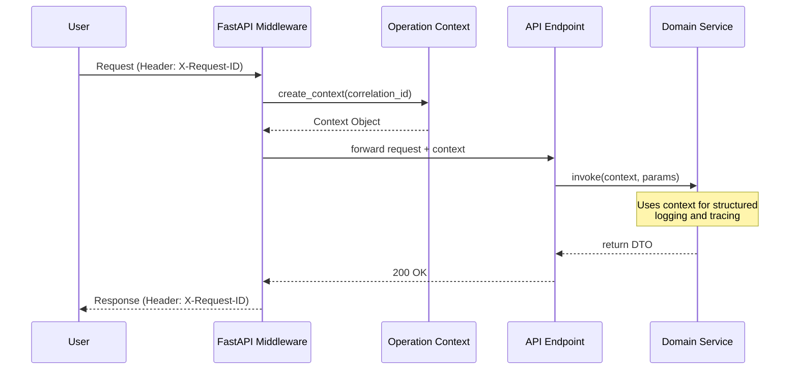

```mermaid
sequenceDiagram
    participant User
    participant Middleware as FastAPI Middleware
    participant Context as Operation Context
    participant Router as API Endpoint
    participant Service as Domain Service

    User->>Middleware: Request (Header: X-Request-ID)
    Middleware->>Context: create_context(correlation_id)
    Context-->>Middleware: Context Object
    Middleware->>Router: forward request + context
    Router->>Service: invoke(context, params)
    
    Note over Service: Uses context for structured<br/>logging and tracing
    
    Service-->>Router: return DTO
    Router-->>Middleware: 200 OK
    Middleware-->>User: Response (Header: X-Request-ID)
```
