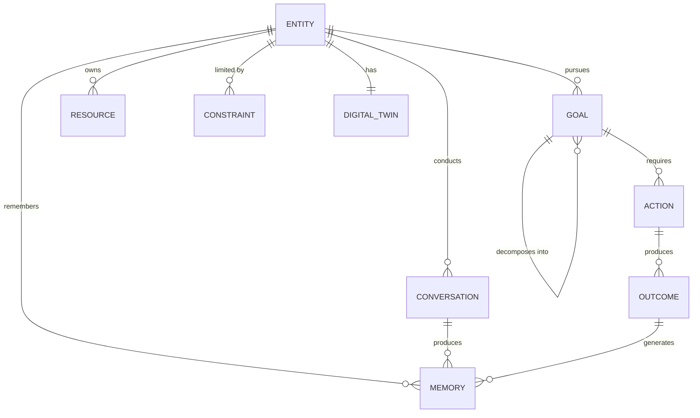
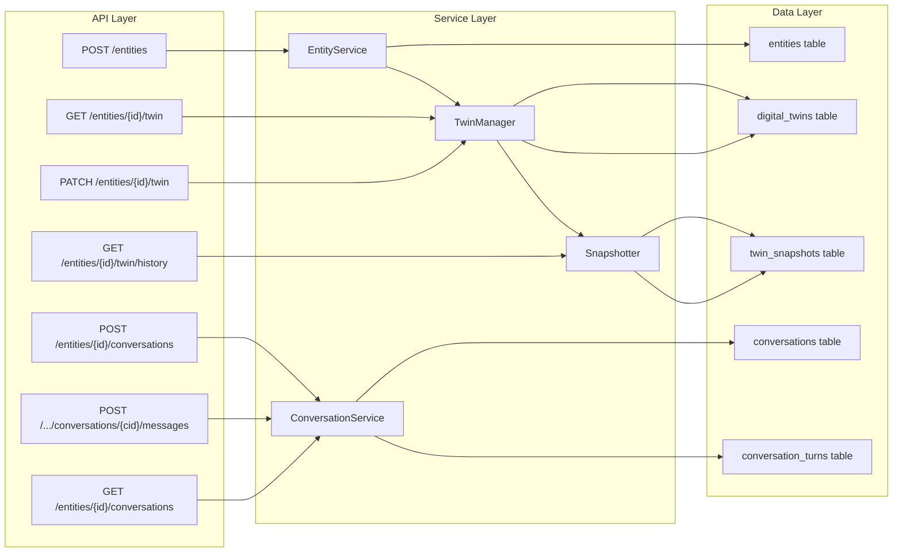
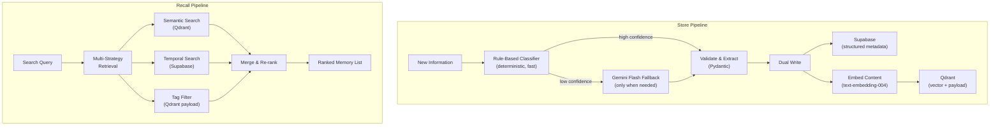
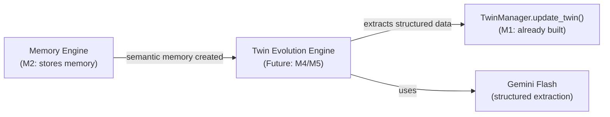

# BizOS — Sprint Execution Plan

> **Status**: REVISED v2 — CTO changes applied. Awaiting final approval.  
> **Sprint Scope**: Milestone 0 + Milestone 1 + Milestone 2  
> **Developer**: Solo  
> **Date**: June 24, 2026  
> **Revision**: v2 — 4 CTO changes applied

---

# Changelog (v2)

| # | Change | Impact |
|---|--------|--------|
| C1 | **Simplified memory classification** — rule-based first, Gemini Flash fallback only on low confidence | Reduced latency, cost, and complexity for memory storage pipeline |
| C2 | **Context Engine moved to Milestone 3** — M2 is now Memory Engine only | Smaller, more focused M2; cleaner separation of concerns |
| C3 | **Conversation storage added** — new `conversations` + `conversation_turns` tables, models, and endpoints | Raw conversation history preserved before memory extraction |
| C4 | **Twin Evolution Engine documented** — future architecture note for Memory → Twin updates | No code change; roadmap clarity for post-sprint integration |

---

# Part 1: CTO Decisions

## Decision 1: MVP Vertical → Entrepreneur / Startup Founder

**Decision**: Entrepreneur / Startup Founder.

**Reasoning**:
- This vertical exercises every single engine. A student scenario never touches finances meaningfully. Personal finance never spawns agents. Entrepreneur hits all 8: Digital Twin (finances, skills, team), Goals (launch, grow, fundraise), Memory (investor conversations, market research), Simulation (hiring, burn rate), Dynamic Agents (marketing, research, finance), Execution (reports, outreach), Learning (campaign outcomes, conversion data).
- XPRIZE judges want to see the **full** AI Operating System paradigm, not a fraction of it. Entrepreneur forces us to demonstrate the complete loop.
- The narrative is compelling: *"Meet Priya. She has an idea, ₹5L, and BizOS. Watch what happens."*

---

## Decision 2: Deployment → Local-First, Cloud-Ready

**Decision**: Local-first development. Cloud deploy only for XPRIZE demo submission.

**Reasoning**:
- Solo developer needs sub-second feedback loops. Deploying to Cloud Run for every test wastes time.
- Supabase is already cloud-hosted (free tier) — no local Postgres needed.
- Qdrant runs locally via Docker with zero config.
- The architecture is already Cloud Run-compatible (stateless FastAPI). Deploying later is a 2-hour task, not an architectural change.
- Cost: $0 during development. Gemini API has free tier / XPRIZE credits.

**Local stack**: Supabase (cloud free tier) + Qdrant (Docker) + FastAPI (uvicorn) + Gemini API (direct).

---

## Decision 3: Frontend → Minimal UI (Option B)

**Decision**: Minimal web UI — conversation panel + goal tree view.

**Reasoning**:
- API-only won't impress judges. They need to **see** BizOS think.
- Full dashboard is 3-4 weeks of frontend work that a solo developer cannot afford.
- Minimal UI is buildable in 3-4 days with a single HTML+JS page using SSE streaming. No React, no framework, no build step.
- What judges need to see: (1) natural language conversation with visible agent reasoning, (2) goal tree visualization, (3) Digital Twin state card. That's 3 panels on one page.

**Implementation**: Single `index.html` with vanilla JS + CSS. No framework. No build toolchain. Served directly by FastAPI's `StaticFiles`.

---

## Decision 4: Team → Solo Developer, Intermediate-Advanced Python

**Decision**: Assume 1 developer. Strong Python. Familiar with FastAPI. New to LangGraph and Qdrant.

**Impact on implementation**:
- **No parallelization** — milestones are sequential. Each must be stable before the next starts.
- **Minimize infrastructure** — every extra service is a debugging surface. Two services max (Supabase + Qdrant).
- **No premature abstraction** — skip the abstract interface protocols from the blueprint. Write concrete classes. Refactor to interfaces when there are two implementations.
- **Test at the API boundary** — unit tests per engine are ideal but costly. Integration tests at the API level catch more bugs per hour spent.
- **Use Supabase client directly** — skip SQLAlchemy. The `supabase-py` client is simpler for a solo dev.

---

## Decision 5: Redis → No. Excluded from MVP.

**Decision**: No Redis in MVP.

**Reasoning**:
- Redis was planned for 3 things: session state, pub/sub events, and task queue.
- **Session state**: Store in-memory (Python dict keyed by entity_id). The solo dev runs one process. This is fine until there are multiple API instances (post-MVP).
- **Pub/sub events**: Not needed in MVP. The Learning Loop is called synchronously after execution, not triggered by events.
- **Task queue**: Memory consolidation (the only background job in MVP) runs as a FastAPI background task or a simple `asyncio.create_task`. No need for `arq` yet.
- **Net effect**: One fewer Docker container, one fewer client library, one fewer failure mode. Add Redis in Phase 3 when scaling matters.

**Revised local stack**: Supabase (cloud) + Qdrant (Docker) + FastAPI (uvicorn) + Gemini API.

---

# Part 2: Sprint Execution — Milestones 0, 1, 2

---

## Milestone 0: Business Foundation Model (BFM)

### Objective

Define the 7 core domain primitives that every engine in BizOS operates on. These are the **nouns** of the system. Every database table, API endpoint, and engine method will reference these types. Getting them right now prevents refactoring later.

### Technical Design

The Business Foundation Model defines 7 first-class objects. Each is a Pydantic model with validation rules, stored in Supabase, and referenced by UUID.



### Data Structures

#### 1. Entity

The root object. Represents who/what BizOS is helping.

```python
class EntityType(str, Enum):
    INDIVIDUAL = "individual"
    STARTUP = "startup"
    SMALL_BUSINESS = "small_business"
    STUDENT = "student"
    ORGANIZATION = "organization"

class EntityCreate(BaseModel):
    """Request schema for creating an entity."""
    name: str = Field(..., min_length=1, max_length=200)
    entity_type: EntityType
    description: str | None = Field(None, max_length=2000)
    metadata: dict = Field(default_factory=dict)

class Entity(BaseModel):
    """Full entity object from database."""
    id: UUID
    user_id: UUID
    name: str
    entity_type: EntityType
    description: str | None
    metadata: dict
    is_active: bool
    created_at: datetime
    updated_at: datetime
```

**Validation rules**:
- `name`: required, 1-200 chars, stripped whitespace
- `entity_type`: must be one of the enum values
- `metadata`: arbitrary JSON, max 10KB
- One user can have one entity in MVP (enforced at API level, not DB level — keeps schema flexible for post-MVP)

---

#### 2. Goal

First-class object. Goals have hierarchy, status, and AI-managed plans.

```python
class GoalType(str, Enum):
    STRATEGIC = "strategic"      # Long-term, big picture ("Launch startup")
    TACTICAL = "tactical"        # Medium-term, supports strategic ("Validate market")
    OPERATIONAL = "operational"  # Short-term, concrete ("Interview 20 customers")
    HABIT = "habit"              # Recurring ("Review expenses weekly")

class GoalStatus(str, Enum):
    DRAFT = "draft"
    ACTIVE = "active"
    IN_PROGRESS = "in_progress"
    BLOCKED = "blocked"
    COMPLETED = "completed"
    ABANDONED = "abandoned"
    PAUSED = "paused"

class GoalCreate(BaseModel):
    """Request schema for creating a goal."""
    title: str = Field(..., min_length=1, max_length=500)
    description: str | None = Field(None, max_length=5000)
    goal_type: GoalType = GoalType.STRATEGIC
    parent_goal_id: UUID | None = None
    priority: int = Field(default=5, ge=1, le=10)
    target_date: datetime | None = None
    success_criteria: list[str] = Field(default_factory=list)

class Goal(BaseModel):
    """Full goal object."""
    id: UUID
    entity_id: UUID
    parent_goal_id: UUID | None
    title: str
    description: str | None
    goal_type: GoalType
    status: GoalStatus
    priority: int
    progress: float                    # 0.0 to 1.0
    success_criteria: list[str]
    target_date: datetime | None
    completed_at: datetime | None
    ai_plan: dict                      # LLM-generated decomposition
    blockers: list[dict]               # [{description, detected_at, resolved}]
    adaptations: list[dict]            # [{reason, old_plan, new_plan, timestamp}]
    depth: int                         # 0 = root goal
    path: list[str]                    # Materialized path ["root_id", "parent_id", "self_id"]
    created_at: datetime
    updated_at: datetime
```

**Validation rules**:
- `title`: required, 1-500 chars
- `priority`: integer 1-10, default 5
- `progress`: float 0.0-1.0, only settable by the system (not user)
- `parent_goal_id`: if set, must reference an existing goal owned by the same entity
- `target_date`: must be in the future at creation time
- `depth`: auto-calculated from parent chain (max depth = 5 in MVP to prevent runaway decomposition)
- `path`: auto-populated on create, used for fast tree queries

**Status transition rules**:
```
DRAFT → ACTIVE           (when AI plan is generated)
ACTIVE → IN_PROGRESS     (when first sub-goal starts)
IN_PROGRESS → BLOCKED    (when blocker detected)
BLOCKED → IN_PROGRESS    (when blocker resolved)
IN_PROGRESS → COMPLETED  (when all success criteria met)
IN_PROGRESS → ABANDONED  (user decision)
ACTIVE → PAUSED          (user decision)
PAUSED → ACTIVE          (user decision)
```

---

#### 3. Resource

What the entity has available — money, tools, people, time.

```python
class ResourceType(str, Enum):
    FINANCIAL = "financial"       # Cash, funding, revenue
    HUMAN = "human"               # Team members, advisors, mentors
    TOOL = "tool"                 # Software, platforms, subscriptions
    TIME = "time"                 # Available hours per week
    KNOWLEDGE = "knowledge"       # Skills, expertise, certifications
    NETWORK = "network"           # Contacts, communities, partnerships

class Resource(BaseModel):
    """A resource available to the entity."""
    id: UUID
    entity_id: UUID
    resource_type: ResourceType
    name: str                          # "AWS Credits", "Co-founder (Technical)", "₹5L Funding"
    description: str | None
    quantity: float | None             # Numeric value if applicable
    unit: str | None                   # "INR", "hours/week", "seats"
    metadata: dict                     # Flexible attributes
    is_active: bool
    created_at: datetime
    updated_at: datetime
```

**Validation rules**:
- `name`: required, 1-200 chars
- `quantity`: non-negative if provided
- Resources are NOT stored in a separate table in MVP. They live inside the Digital Twin's `resources` JSONB field. The Pydantic model is used for validation and serialization when reading/writing the twin.

**Rationale for JSONB storage**: A separate `resources` table would be normalized but adds complexity. Resources are always read alongside the Digital Twin. JSONB inside `digital_twins.resources` keeps reads fast (one query) and writes simple. If resource-level queries become necessary post-MVP, extract to a table then.

---

#### 4. Constraint

What limits the entity — budget caps, time restrictions, regulatory requirements.

```python
class ConstraintType(str, Enum):
    FINANCIAL = "financial"        # "Budget cannot exceed ₹1L/month"
    TEMPORAL = "temporal"          # "Must launch before October"
    REGULATORY = "regulatory"     # "Must comply with GDPR"
    PERSONAL = "personal"         # "Cannot work weekends"
    TECHNICAL = "technical"       # "Must use Python, no Java"

class Constraint(BaseModel):
    """A constraint limiting the entity."""
    id: UUID
    entity_id: UUID
    constraint_type: ConstraintType
    description: str               # Human-readable description
    severity: str                  # "hard" (cannot violate) or "soft" (prefer not to)
    is_active: bool
    metadata: dict
    created_at: datetime
    updated_at: datetime
```

**Validation rules**:
- `severity`: must be "hard" or "soft"
- `description`: required, 1-1000 chars

**Storage**: Like Resources, stored inside the Digital Twin's `constraints` JSONB field. Same rationale — always read with the twin, rarely queried independently.

---

#### 5. Memory

The foundational unit of BizOS's persistent intelligence.

```python
class MemoryType(str, Enum):
    EPISODIC = "episodic"          # "User said they launched a campaign on June 15"
    SEMANTIC = "semantic"          # "User's startup is in EdTech"
    PROCEDURAL = "procedural"     # "Cold emails with personal hooks convert 3x better"

class MemorySource(str, Enum):
    CONVERSATION = "conversation"
    DOCUMENT = "document"
    EXECUTION = "execution"        # Output of an agent action
    OBSERVATION = "observation"    # System-derived insight
    USER_INPUT = "user_input"      # Explicit user statement

class MemoryCreate(BaseModel):
    """Schema for creating a memory."""
    content: str = Field(..., min_length=1, max_length=10000)
    memory_type: MemoryType
    source: MemorySource
    importance: float = Field(default=0.5, ge=0.0, le=1.0)
    domain_tags: list[str] = Field(default_factory=list)
    context_tags: list[str] = Field(default_factory=list)

class Memory(BaseModel):
    """Full memory object."""
    id: UUID
    entity_id: UUID
    memory_type: MemoryType
    content: str
    summary: str | None                # AI-generated summary
    source: MemorySource
    importance: float                  # 0.0-1.0
    emotional_valence: float           # -1.0 to 1.0
    qdrant_point_id: UUID | None       # Reference to vector
    collection_name: str | None
    domain_tags: list[str]             # ["business", "marketing", "finance"]
    context_tags: list[str]            # ["startup_launch", "q1_2026"]
    access_count: int
    last_accessed: datetime | None
    is_consolidated: bool
    created_at: datetime
    updated_at: datetime
```

**Validation rules**:
- `content`: required, 1-10,000 chars
- `importance`: float 0.0-1.0, defaults to 0.5
- `emotional_valence`: float -1.0 to 1.0, defaults to 0.0 (neutral)
- `domain_tags`: max 10 tags, each 1-50 chars
- `access_count`: auto-incremented on retrieval (never set by client)

**Storage**: Dual storage — Supabase `memories` table (structured metadata) + Qdrant (vector embedding for semantic search). The `qdrant_point_id` links them.

---

#### 6. Action

Something an agent or the system does in pursuit of a goal.

```python
class ActionType(str, Enum):
    LLM_INFERENCE = "llm_inference"    # Asking Gemini to reason
    TOOL_CALL = "tool_call"            # Using a tool (web search, doc gen)
    NOTIFICATION = "notification"      # Sending a reminder/alert to user
    STATE_UPDATE = "state_update"      # Updating the Digital Twin
    MEMORY_WRITE = "memory_write"      # Storing a new memory

class ActionStatus(str, Enum):
    PENDING = "pending"
    RUNNING = "running"
    SUCCESS = "success"
    FAILURE = "failure"
    NEEDS_APPROVAL = "needs_approval"
    CANCELLED = "cancelled"

class Action(BaseModel):
    """An action taken by an agent or the system."""
    id: UUID
    entity_id: UUID
    agent_id: UUID | None              # Which agent performed this
    goal_id: UUID | None               # Which goal this serves
    action_type: ActionType
    action_detail: dict                # Full payload (tool name, args, etc.)
    status: ActionStatus
    expected_outcome: str | None
    actual_outcome: str | None
    tokens_input: int
    tokens_output: int
    duration_ms: int
    requires_approval: bool
    error_message: str | None
    created_at: datetime
```

**Validation rules**:
- `action_detail`: required, must be valid JSON, max 50KB
- `status`: transitions are enforced: PENDING → RUNNING → SUCCESS/FAILURE
- `tokens_input`/`tokens_output`: non-negative integers, auto-populated

**Storage**: Supabase `execution_logs` table (this is the same table from the blueprint, just with the model named `Action` in the domain layer for clarity).

---

#### 7. Outcome

The result of an action, with evaluation for the Learning Loop.

```python
class OutcomeVerdict(str, Enum):
    AS_EXPECTED = "as_expected"
    BETTER = "better_than_expected"
    WORSE = "worse_than_expected"
    UNEXPECTED = "unexpected"
    FAILED = "failed"

class Outcome(BaseModel):
    """Evaluation of an action's result."""
    id: UUID
    entity_id: UUID
    action_id: UUID                    # Which action produced this
    goal_id: UUID | None               # Which goal this was for
    expected: str                      # What we expected to happen
    actual: str                        # What actually happened
    verdict: OutcomeVerdict
    lessons: list[str]                 # Extracted insights
    confidence: float                  # 0.0-1.0 — how sure we are of the evaluation
    should_update_twin: bool           # Whether this should modify the Digital Twin
    twin_updates: dict                 # Specific twin fields to update
    created_at: datetime
```

**Validation rules**:
- `expected` and `actual`: required, 1-5000 chars
- `confidence`: float 0.0-1.0
- `lessons`: list of strings, max 10 lessons per outcome, each max 500 chars

**Storage**: Supabase `lessons_learned` table. Lessons are also embedded in Qdrant for semantic retrieval by the Learning Loop.

---

### Relationships Between Models

```
Entity (1) ──────── (1) Digital Twin
Entity (1) ──────── (N) Goals
Entity (1) ──────── (N) Memories
Entity (1) ──────── (N) Conversations
Conversation (1) ── (N) Conversation Turns
Conversation (1) ── (N) Memories (extracted from turns)
Goal   (1) ──────── (N) Sub-Goals (self-referencing)
Goal   (1) ──────── (N) Actions
Action (1) ──────── (1) Outcome
Outcome(1) ──────── (N) Memories (lessons stored as memories)
```

**Key invariant**: Every object in the system belongs to exactly one Entity. There are no cross-entity references. This is enforced by RLS at the database level and by every API endpoint requiring `entity_id` in the URL path.

---

### Storage Strategy Summary

| Model | Primary Storage | Secondary Storage | Query Pattern |
|-------|----------------|-------------------|---------------|
| Entity | Supabase `entities` | — | By user_id, by id |
| Goal | Supabase `goals` | — | By entity_id + status, tree traversal via path |
| Resource | Supabase `digital_twins.resources` (JSONB) | — | Always loaded with twin |
| Constraint | Supabase `digital_twins.constraints` (JSONB) | — | Always loaded with twin |
| Memory | Supabase `memories` | Qdrant (vector embedding) | Semantic search, temporal, by type + tags |
| Conversation | Supabase `conversations` + `conversation_turns` | — | By entity_id + time |
| Action | Supabase `execution_logs` | — | By entity_id + time, by goal_id |
| Outcome | Supabase `lessons_learned` | Qdrant (vector embedding) | Semantic search for relevant lessons |

---

### Development Tasks — Milestone 0

| # | Task | Estimated Time | Output |
|---|------|:-------------:|--------|
| 0.1 | Create project skeleton with `uv init` | 30 min | `pyproject.toml`, `.env.example`, `app/` dir |
| 0.2 | Install core dependencies (FastAPI, Pydantic, supabase-py, qdrant-client, google-genai) | 15 min | `pyproject.toml` populated |
| 0.3 | Create `app/config.py` with Pydantic BaseSettings | 30 min | Settings class with all env vars |
| 0.4 | Create `app/models/enums.py` with all enums | 30 min | All enum classes |
| 0.5 | Create `app/models/schemas.py` with all 7 BFM Pydantic models + Conversation models | 2.5 hours | All Create/Read schemas |
| 0.6 | Create Supabase project and deploy schema SQL (including conversations tables) | 1.5 hours | All tables, indexes, RLS policies live |
| 0.7 | Create `app/services/supabase.py` client wrapper | 30 min | Singleton client with connection pooling |
| 0.8 | Create `docker-compose.yml` for Qdrant | 15 min | Qdrant running on localhost:6333 |
| 0.9 | Create `app/services/qdrant.py` client wrapper | 30 min | Singleton client, collection creation on startup |
| 0.10 | Create `app/services/gemini.py` wrapper | 45 min | Wrapper for Pro + Flash + embeddings |
| 0.11 | Create `app/main.py` FastAPI app with lifespan | 30 min | Health check endpoint works |
| 0.12 | Write smoke tests (health check, DB connectivity, Qdrant connectivity) | 45 min | `tests/test_smoke.py` passing |

**Total estimated time**: ~9 hours (1 full day)

### Testing Strategy — Milestone 0

- **Smoke tests**: Health check returns 200. Supabase connection succeeds. Qdrant connection succeeds. Gemini API responds.
- **Schema validation tests**: Each Pydantic model rejects invalid inputs (missing fields, out-of-range values, wrong types).
- **No integration tests yet** — there's nothing to integrate.

### Definition of Done — Milestone 0

- [ ] FastAPI app starts with `uvicorn app.main:app`
- [ ] `GET /api/v1/health` returns `{"status": "ok"}`
- [ ] All 7 BFM Pydantic models defined with validation rules
- [ ] Conversation + ConversationTurn Pydantic models defined
- [ ] All enums defined
- [ ] Supabase schema deployed with all tables (including conversations) and RLS
- [ ] Qdrant running locally via Docker
- [ ] Gemini API wrapper can call Pro, Flash, and Embedding models
- [ ] All smoke tests pass
- [ ] `.env.example` documents all required environment variables

---

## Milestone 1: Digital Twin System + Conversation Storage

### Objective

Implement the Digital Twin as a living, versioned state object, AND basic conversation storage. After this milestone, a developer can: create an entity via API, see its Digital Twin auto-created, update twin dimensions, view version history, and store/retrieve conversation history.

### Technical Design



#### How Digital Twins Work

**Creation**: When an entity is created via `POST /api/v1/entities`, the `EntityService`:
1. Inserts a row into `entities`
2. Calls `TwinManager.create_twin(entity_id)` which inserts a row into `digital_twins` with empty JSONB fields
3. Returns the entity with its twin

**Reading**: `GET /api/v1/entities/{id}/twin` calls `TwinManager.get_twin(entity_id)` which:
1. Fetches the `digital_twins` row
2. Returns the full state as a Pydantic model

**Updating**: `PATCH /api/v1/entities/{id}/twin` accepts a partial update. The `TwinManager`:
1. Fetches the current twin state
2. Deep-merges the update into the existing JSONB fields (not replace — merge)
3. Calculates the delta between old and new state
4. If the delta exceeds the snapshot threshold, calls `Snapshotter.create_snapshot()`
5. Increments `twin_version`
6. Saves the updated twin

**Versioning**: The `Snapshotter` creates a point-in-time copy:
1. Serializes the full twin state to JSONB
2. Computes the delta from the previous snapshot
3. Stores both in `twin_snapshots` with a `change_reason`
4. This is called automatically on significant updates and can be called manually

**History**: `GET /api/v1/entities/{id}/twin/history` returns a paginated list of snapshots, showing how the twin evolved over time.

#### How Conversation Storage Works

**Purpose**: Store raw conversation history before any memory extraction happens. This is the source-of-truth for what was said. Memory extraction (Conversation → Memory) happens in a later milestone.

**Flow**:
```
User speaks → API stores turn in conversation_turns → (Future: Memory extraction pipeline)
```

**Start conversation**: `POST /api/v1/entities/{id}/conversations` creates a new conversation.

**Add message**: `POST /api/v1/entities/{id}/conversations/{conv_id}/messages` appends a turn. The `turn_index` is auto-incremented. Both user and assistant messages are stored.

**List conversations**: `GET /api/v1/entities/{id}/conversations` returns conversations ordered by most recent.

**Get conversation**: `GET /api/v1/entities/{id}/conversations/{conv_id}` returns conversation with all turns.

---

### Database Tables

```sql
-- Entity table (core)
CREATE TABLE IF NOT EXISTS entities (
    id              UUID PRIMARY KEY DEFAULT gen_random_uuid(),
    user_id         UUID NOT NULL,
    name            TEXT NOT NULL,
    entity_type     TEXT NOT NULL CHECK (entity_type IN (
                        'individual', 'startup', 'small_business',
                        'student', 'organization'
                    )),
    description     TEXT,
    metadata        JSONB DEFAULT '{}',
    is_active       BOOLEAN DEFAULT TRUE,
    created_at      TIMESTAMPTZ DEFAULT now(),
    updated_at      TIMESTAMPTZ DEFAULT now()
);

-- Digital Twin table (1:1 with entity)
CREATE TABLE IF NOT EXISTS digital_twins (
    id              UUID PRIMARY KEY DEFAULT gen_random_uuid(),
    entity_id       UUID UNIQUE NOT NULL REFERENCES entities(id) ON DELETE CASCADE,
    demographics    JSONB DEFAULT '{}',
    finances        JSONB DEFAULT '{}',
    resources       JSONB DEFAULT '{}',
    skills          JSONB DEFAULT '{}',
    relationships   JSONB DEFAULT '{}',
    behaviors       JSONB DEFAULT '{}',
    constraints     JSONB DEFAULT '{}',
    twin_version    INTEGER DEFAULT 1,
    last_snapshot   TIMESTAMPTZ DEFAULT now(),
    health_score    FLOAT DEFAULT 0.5,
    created_at      TIMESTAMPTZ DEFAULT now(),
    updated_at      TIMESTAMPTZ DEFAULT now()
);

-- Twin version history
CREATE TABLE IF NOT EXISTS twin_snapshots (
    id              UUID PRIMARY KEY DEFAULT gen_random_uuid(),
    entity_id       UUID NOT NULL REFERENCES entities(id) ON DELETE CASCADE,
    twin_version    INTEGER NOT NULL,
    snapshot_data   JSONB NOT NULL,
    change_reason   TEXT,
    delta           JSONB DEFAULT '{}',
    created_at      TIMESTAMPTZ DEFAULT now()
);

-- Conversations (C3: NEW)
CREATE TABLE IF NOT EXISTS conversations (
    id              UUID PRIMARY KEY DEFAULT gen_random_uuid(),
    entity_id       UUID NOT NULL REFERENCES entities(id) ON DELETE CASCADE,
    title           TEXT,
    status          TEXT DEFAULT 'active' CHECK (status IN ('active', 'archived')),
    summary         TEXT,
    turn_count      INTEGER DEFAULT 0,
    metadata        JSONB DEFAULT '{}',
    created_at      TIMESTAMPTZ DEFAULT now(),
    updated_at      TIMESTAMPTZ DEFAULT now()
);

-- Conversation turns (C3: NEW)
CREATE TABLE IF NOT EXISTS conversation_turns (
    id              UUID PRIMARY KEY DEFAULT gen_random_uuid(),
    conversation_id UUID NOT NULL REFERENCES conversations(id) ON DELETE CASCADE,
    role            TEXT NOT NULL CHECK (role IN ('user', 'assistant', 'system', 'tool')),
    content         TEXT NOT NULL,
    agent_id        UUID,
    tokens_used     INTEGER DEFAULT 0,
    tool_calls      JSONB DEFAULT '[]',
    turn_index      INTEGER NOT NULL,
    created_at      TIMESTAMPTZ DEFAULT now()
);

-- Indexes
CREATE INDEX IF NOT EXISTS idx_entities_user ON entities(user_id);
CREATE INDEX IF NOT EXISTS idx_twins_entity ON digital_twins(entity_id);
CREATE INDEX IF NOT EXISTS idx_snapshots_entity ON twin_snapshots(entity_id, created_at DESC);
CREATE INDEX IF NOT EXISTS idx_conversations_entity ON conversations(entity_id, updated_at DESC);
CREATE INDEX IF NOT EXISTS idx_turns_conversation ON conversation_turns(conversation_id, turn_index);

-- RLS
ALTER TABLE entities ENABLE ROW LEVEL SECURITY;
ALTER TABLE digital_twins ENABLE ROW LEVEL SECURITY;
ALTER TABLE twin_snapshots ENABLE ROW LEVEL SECURITY;
ALTER TABLE conversations ENABLE ROW LEVEL SECURITY;
ALTER TABLE conversation_turns ENABLE ROW LEVEL SECURITY;

CREATE POLICY entity_owner ON entities FOR ALL USING (user_id = auth.uid());
CREATE POLICY twin_owner ON digital_twins FOR ALL
    USING (entity_id IN (SELECT id FROM entities WHERE user_id = auth.uid()));
CREATE POLICY snapshot_owner ON twin_snapshots FOR ALL
    USING (entity_id IN (SELECT id FROM entities WHERE user_id = auth.uid()));
CREATE POLICY conversation_owner ON conversations FOR ALL
    USING (entity_id IN (SELECT id FROM entities WHERE user_id = auth.uid()));
CREATE POLICY turn_owner ON conversation_turns FOR ALL
    USING (conversation_id IN (
        SELECT id FROM conversations WHERE entity_id IN (
            SELECT id FROM entities WHERE user_id = auth.uid()
        )
    ));

-- Auto-update updated_at
CREATE OR REPLACE FUNCTION update_updated_at()
RETURNS TRIGGER AS $$
BEGIN
    NEW.updated_at = now();
    RETURN NEW;
END;
$$ LANGUAGE plpgsql;

CREATE TRIGGER entities_updated_at BEFORE UPDATE ON entities
    FOR EACH ROW EXECUTE FUNCTION update_updated_at();
CREATE TRIGGER twins_updated_at BEFORE UPDATE ON digital_twins
    FOR EACH ROW EXECUTE FUNCTION update_updated_at();
CREATE TRIGGER conversations_updated_at BEFORE UPDATE ON conversations
    FOR EACH ROW EXECUTE FUNCTION update_updated_at();
```

---

### API Endpoints

| Method | Path | Description | Request Body | Response |
|--------|------|-------------|-------------|----------|
| `POST` | `/api/v1/entities` | Create entity + auto-create twin | `EntityCreate` | `Entity` with embedded twin |
| `GET` | `/api/v1/entities/{id}` | Get entity by ID | — | `Entity` |
| `PATCH` | `/api/v1/entities/{id}` | Update entity metadata | Partial `EntityCreate` | `Entity` |
| `DELETE` | `/api/v1/entities/{id}` | Soft-delete entity | — | `204 No Content` |
| `GET` | `/api/v1/entities/{id}/twin` | Get Digital Twin state | — | `DigitalTwin` |
| `PATCH` | `/api/v1/entities/{id}/twin` | Update twin dimensions | `TwinUpdate` (partial JSONB) | `DigitalTwin` |
| `GET` | `/api/v1/entities/{id}/twin/history` | Get twin version history | Query: `?limit=20&offset=0` | `List[TwinSnapshot]` |
| `POST` | `/api/v1/entities/{id}/conversations` | Start new conversation | `ConversationCreate` | `Conversation` |
| `GET` | `/api/v1/entities/{id}/conversations` | List conversations | Query: `?limit=20&offset=0` | `List[Conversation]` |
| `GET` | `/api/v1/entities/{id}/conversations/{cid}` | Get conversation with turns | — | `ConversationWithTurns` |
| `POST` | `/api/v1/entities/{id}/conversations/{cid}/messages` | Add a turn | `TurnCreate` | `ConversationTurn` |
| `GET` | `/api/v1/health` | Health check | — | `{"status": "ok"}` |

---

### Python Modules

#### `app/models/schemas.py` — Pydantic Schemas (extend M0)

```python
# Add to existing schemas from M0:

class TwinDimensions(BaseModel):
    """The 7 mutable state dimensions of a Digital Twin."""
    demographics: dict = Field(default_factory=dict)
    finances: dict = Field(default_factory=dict)
    resources: dict = Field(default_factory=dict)
    skills: dict = Field(default_factory=dict)
    relationships: dict = Field(default_factory=dict)
    behaviors: dict = Field(default_factory=dict)
    constraints: dict = Field(default_factory=dict)

class DigitalTwin(BaseModel):
    """Full Digital Twin read model."""
    id: UUID
    entity_id: UUID
    demographics: dict
    finances: dict
    resources: dict
    skills: dict
    relationships: dict
    behaviors: dict
    constraints: dict
    twin_version: int
    last_snapshot: datetime
    health_score: float
    created_at: datetime
    updated_at: datetime

class TwinUpdate(BaseModel):
    """Partial update to twin dimensions. Only provided fields are merged."""
    demographics: dict | None = None
    finances: dict | None = None
    resources: dict | None = None
    skills: dict | None = None
    relationships: dict | None = None
    behaviors: dict | None = None
    constraints: dict | None = None

    model_config = ConfigDict(extra="forbid")

class TwinSnapshot(BaseModel):
    """A point-in-time snapshot of the twin state."""
    id: UUID
    entity_id: UUID
    twin_version: int
    snapshot_data: dict
    change_reason: str | None
    delta: dict
    created_at: datetime

# --- Conversation Models (C3: NEW) ---

class ConversationCreate(BaseModel):
    """Request schema for starting a conversation."""
    title: str | None = Field(None, max_length=500)
    metadata: dict = Field(default_factory=dict)

class Conversation(BaseModel):
    """Conversation read model."""
    id: UUID
    entity_id: UUID
    title: str | None
    status: str
    summary: str | None
    turn_count: int
    metadata: dict
    created_at: datetime
    updated_at: datetime

class TurnCreate(BaseModel):
    """Request schema for adding a conversation turn."""
    role: str = Field(..., pattern="^(user|assistant|system|tool)$")
    content: str = Field(..., min_length=1, max_length=50000)

class ConversationTurn(BaseModel):
    """A single turn in a conversation."""
    id: UUID
    conversation_id: UUID
    role: str
    content: str
    agent_id: UUID | None
    tokens_used: int
    tool_calls: list[dict]
    turn_index: int
    created_at: datetime

class ConversationWithTurns(BaseModel):
    """Conversation with all its turns."""
    conversation: Conversation
    turns: list[ConversationTurn]
```

#### `app/twin/manager.py` — TwinManager

```
class TwinManager:
    """Manages Digital Twin CRUD and evolution."""

    __init__(self, supabase: SupabaseClient)
    
    async create_twin(entity_id: UUID) -> DigitalTwin
        # Insert empty twin row, return model
    
    async get_twin(entity_id: UUID) -> DigitalTwin
        # Fetch from digital_twins table
    
    async update_twin(entity_id: UUID, update: TwinUpdate, reason: str | None) -> DigitalTwin
        # 1. Fetch current state
        # 2. Deep-merge update into current state
        # 3. Compute delta
        # 4. If delta is significant, create snapshot
        # 5. Increment twin_version
        # 6. Save and return
    
    async _deep_merge(base: dict, update: dict) -> dict
        # Recursive dict merge (update overwrites base at leaf level)
    
    async _compute_delta(old: dict, new: dict) -> dict
        # Return only the changed key paths
    
    async _is_significant_change(delta: dict) -> bool
        # Returns True if any top-level dimension changed
```

#### `app/twin/snapshotter.py` — Snapshotter

```
class Snapshotter:
    """Manages twin version snapshots."""

    __init__(self, supabase: SupabaseClient)
    
    async create_snapshot(entity_id: UUID, twin_version: int, 
                          snapshot_data: dict, delta: dict, reason: str | None) -> TwinSnapshot
        # Insert into twin_snapshots
    
    async get_history(entity_id: UUID, limit: int = 20, offset: int = 0) -> list[TwinSnapshot]
        # Fetch snapshots ordered by created_at DESC
    
    async get_snapshot(snapshot_id: UUID) -> TwinSnapshot
        # Fetch a single snapshot by ID
```

#### `app/services/entity_service.py` — EntityService

```
class EntityService:
    """Manages Entity lifecycle."""

    __init__(self, supabase: SupabaseClient, twin_manager: TwinManager)
    
    async create_entity(user_id: UUID, data: EntityCreate) -> Entity
        # 1. Insert into entities table
        # 2. Call twin_manager.create_twin(entity_id)
        # 3. Return entity
    
    async get_entity(entity_id: UUID) -> Entity
        # Fetch from entities table
    
    async update_entity(entity_id: UUID, data: dict) -> Entity
        # Update entity fields
    
    async delete_entity(entity_id: UUID) -> None
        # Soft delete (is_active = False)
```

#### `app/services/conversation_service.py` — ConversationService (C3: NEW)

```
class ConversationService:
    """Manages conversation storage."""

    __init__(self, supabase: SupabaseClient)
    
    async create_conversation(entity_id: UUID, data: ConversationCreate) -> Conversation
        # Insert into conversations table
    
    async list_conversations(entity_id: UUID, limit: int = 20, offset: int = 0) -> list[Conversation]
        # Fetch conversations ordered by updated_at DESC
    
    async get_conversation(conversation_id: UUID) -> ConversationWithTurns
        # Fetch conversation + all turns ordered by turn_index
    
    async add_turn(conversation_id: UUID, data: TurnCreate) -> ConversationTurn
        # 1. Get current turn_count
        # 2. Insert turn with turn_index = turn_count
        # 3. Increment turn_count on conversation
        # 4. Update conversation.updated_at
        # 5. Return turn
```

#### `app/api/v1/entities.py` — FastAPI Router (updated)

```
router = APIRouter(prefix="/entities", tags=["entities"])

POST  "/"              → create_entity(data: EntityCreate)
GET   "/{entity_id}"   → get_entity(entity_id: UUID)
PATCH "/{entity_id}"   → update_entity(entity_id: UUID, data: dict)
DELETE"/{entity_id}"   → delete_entity(entity_id: UUID)
GET   "/{entity_id}/twin"          → get_twin(entity_id: UUID)
PATCH "/{entity_id}/twin"          → update_twin(entity_id: UUID, data: TwinUpdate)
GET   "/{entity_id}/twin/history"  → get_twin_history(entity_id: UUID, limit, offset)
```

#### `app/api/v1/conversations.py` — FastAPI Router (C3: NEW)

```
router = APIRouter(prefix="/entities/{entity_id}/conversations", tags=["conversations"])

POST  "/"              → create_conversation(entity_id: UUID, data: ConversationCreate)
GET   "/"              → list_conversations(entity_id: UUID, limit, offset)
GET   "/{conv_id}"     → get_conversation(entity_id: UUID, conv_id: UUID)
POST  "/{conv_id}/messages" → add_turn(entity_id: UUID, conv_id: UUID, data: TurnCreate)
```

---

### Folder Structure (After M0 + M1)

```
bizos/
├── app/
│   ├── __init__.py
│   ├── main.py                    # FastAPI app with lifespan
│   ├── config.py                  # Settings
│   ├── dependencies.py            # DI (get_supabase, get_twin_manager, etc.)
│   │
│   ├── api/
│   │   ├── __init__.py
│   │   └── v1/
│   │       ├── __init__.py
│   │       ├── router.py          # Aggregates all v1 routers
│   │       ├── entities.py        # Entity + Twin endpoints
│   │       ├── conversations.py   # Conversation endpoints (C3: NEW)
│   │       └── system.py          # Health check
│   │
│   ├── models/
│   │   ├── __init__.py
│   │   ├── enums.py               # All enums
│   │   └── schemas.py             # All Pydantic models
│   │
│   ├── services/
│   │   ├── __init__.py
│   │   ├── supabase.py            # Supabase client
│   │   ├── qdrant.py              # Qdrant client (initialized, used in M2)
│   │   ├── gemini.py              # Gemini API wrapper
│   │   ├── entity_service.py      # Entity CRUD logic
│   │   └── conversation_service.py # Conversation CRUD logic (C3: NEW)
│   │
│   ├── twin/
│   │   ├── __init__.py
│   │   ├── manager.py             # TwinManager
│   │   └── snapshotter.py         # Twin versioning
│   │
│   └── utils/
│       ├── __init__.py
│       └── logging.py             # Structured logging setup
│
├── tests/
│   ├── __init__.py
│   ├── conftest.py                # Test fixtures (test user, test entity)
│   ├── test_smoke.py              # Connectivity tests
│   ├── test_entities.py           # Entity CRUD integration tests
│   ├── test_twin.py               # Twin CRUD + versioning tests
│   └── test_conversations.py      # Conversation CRUD tests (C3: NEW)
│
├── scripts/
│   └── deploy_schema.sql          # Full SQL schema for Supabase
│
├── docker-compose.yml             # Qdrant service
├── pyproject.toml
├── .env.example
├── Makefile
└── README.md
```

---

### Development Tasks — Milestone 1

| # | Task | Estimated Time | Dependencies | Output |
|---|------|:-------------:|:------------:|--------|
| 1.1 | Create `TwinDimensions`, `DigitalTwin`, `TwinUpdate`, `TwinSnapshot` Pydantic models | 1 hour | M0.5 | `schemas.py` extended |
| 1.2 | Create `Conversation`, `ConversationCreate`, `TurnCreate`, `ConversationTurn`, `ConversationWithTurns` Pydantic models | 45 min | M0.5 | Conversation schemas ready |
| 1.3 | Deploy entity + twin + snapshot + conversation tables to Supabase | 45 min | M0.6 | Tables live |
| 1.4 | Implement `TwinManager.create_twin()` and `get_twin()` | 1.5 hours | M0.7, 1.1, 1.3 | Read/write works |
| 1.5 | Implement `TwinManager.update_twin()` with deep merge | 2 hours | 1.4 | Partial updates work |
| 1.6 | Implement `TwinManager._compute_delta()` and `_is_significant_change()` | 1 hour | 1.5 | Delta detection works |
| 1.7 | Implement `Snapshotter.create_snapshot()` and `get_history()` | 1.5 hours | 1.3 | Snapshots stored and retrieved |
| 1.8 | Wire snapshot creation into `update_twin()` flow | 30 min | 1.6, 1.7 | Auto-snapshot on significant changes |
| 1.9 | Implement `EntityService.create_entity()` (creates entity + twin atomically) | 1 hour | 1.4, M0.7 | Entity creation works |
| 1.10 | Implement `EntityService.get_entity()`, `update_entity()`, `delete_entity()` | 1 hour | 1.9 | Full CRUD works |
| 1.11 | Implement `ConversationService` — all 4 methods | 1.5 hours | 1.2, 1.3 | Conversation CRUD works |
| 1.12 | Create `app/api/v1/entities.py` router with all 7 twin endpoints | 2 hours | 1.9, 1.10, 1.5, 1.7 | Twin endpoints callable |
| 1.13 | Create `app/api/v1/conversations.py` router with all 4 endpoints | 1 hour | 1.11 | Conversation endpoints callable |
| 1.14 | Create `app/dependencies.py` for dependency injection | 30 min | 1.12, 1.13 | Clean DI |
| 1.15 | Write integration tests: create entity → verify twin → update twin → check snapshot | 2 hours | 1.12 | Tests passing |
| 1.16 | Write integration tests: deep merge edge cases, delta computation, history pagination | 1 hour | 1.15 | Edge cases covered |
| 1.17 | Write integration tests: create conversation → add turns → list → get with turns | 1 hour | 1.13 | Conversation tests passing |
| 1.18 | Manual API testing with sample entrepreneur entity + conversation | 30 min | 1.12, 1.13 | End-to-end verified |

**Total estimated time**: ~20 hours (2.5 days)

### Testing Strategy — Milestone 1

1. **Integration tests** (primary): Hit FastAPI endpoints via `httpx.AsyncClient`, verify database state.
2. **Test scenarios**:
   - Create entity → twin exists with empty dimensions
   - Update twin finances → finances field merged correctly
   - Update twin finances again → snapshot created, version incremented
   - Deep merge: nested keys merge correctly (not overwrite parent)
   - Deep merge: array values replace (not append)
   - Get history: returns snapshots in reverse chronological order
   - Get history: pagination works
   - Delete entity → twin, snapshots, and conversations cascade-deleted
   - Create conversation → returns with id, turn_count = 0
   - Add 3 turns → turn_count = 3, turn_index sequential
   - Get conversation with turns → returns conversation + ordered turns
   - List conversations → ordered by most recent
3. **Fixture**: A test user and test entity created in `conftest.py`, cleaned up after each test.

### Definition of Done — Milestone 1

- [ ] `POST /api/v1/entities` creates entity + auto-creates twin
- [ ] `GET /api/v1/entities/{id}/twin` returns full twin state
- [ ] `PATCH /api/v1/entities/{id}/twin` deep-merges partial updates
- [ ] Twin version increments on update
- [ ] Snapshot auto-created on significant changes
- [ ] `GET /api/v1/entities/{id}/twin/history` returns version history with deltas
- [ ] `POST /api/v1/entities/{id}/conversations` creates a conversation
- [ ] `POST .../conversations/{cid}/messages` appends turns correctly
- [ ] `GET .../conversations/{cid}` returns conversation with all turns
- [ ] All integration tests pass
- [ ] Sample entrepreneur entity + conversation created and verified manually

---

## Milestone 2: Memory Engine

### Objective

Implement persistent, searchable memory — the foundation of BizOS's long-term intelligence. After this milestone, the system can store information, classify it using fast rules (with LLM fallback), embed it as vectors, and retrieve it via semantic search.

> [!IMPORTANT]
> **Change C1 applied**: Memory classification uses a **rule-based classifier first**, with Gemini Flash as fallback only when confidence is low. This eliminates the mandatory LLM call on every memory insertion.

> [!IMPORTANT]
> **Change C2 applied**: Context Engine has been **moved to Milestone 3**. M2 is Memory Engine only — store, recall, forget, stats.

### Technical Design



#### How Memory Classification Works (C1: CHANGED)

**Previous approach**: Every memory insertion called Gemini Flash for classification. This added ~500ms latency and ~$0.001 cost per memory.

**New approach**: Two-tier classification.

**Tier 1 — Rule-Based Classifier (deterministic, ~1ms)**:

```
EPISODIC SIGNALS (events, interactions, temporal references):
  - Temporal markers: "yesterday", "today", "last week", "on June 15", 
    "this morning", "recently", "just now"
  - Event verbs: "launched", "met with", "attended", "discussed", 
    "presented", "signed", "received"
  - Interaction markers: "told me", "we agreed", "the meeting", 
    "during the call"

SEMANTIC SIGNALS (facts, knowledge, state):
  - Identity markers: "our company is", "we are", "I am", "my name is"
  - Possession markers: "we have", "I own", "our budget is", 
    "the team consists of"
  - State markers: "is located in", "was founded in", "specializes in",
    "currently at"

PROCEDURAL SIGNALS (patterns, strategies, how-to):
  - Strategy markers: "works better", "the best way to", "strategy is to",
    "we should always", "never do"
  - Pattern markers: "converts at", "typically leads to", "the trick is",
    "lesson learned"
  - How-to markers: "to achieve this", "the process is", "steps to"

DOMAIN TAG EXTRACTION (keyword-based):
  - Finance keywords: "revenue", "funding", "budget", "expense", "₹", 
    "$", "profit", "cost", "salary"
  - Marketing keywords: "campaign", "ads", "social media", "SEO", 
    "conversion", "leads", "brand"
  - Product keywords: "feature", "MVP", "beta", "launch", "user", 
    "feedback", "bug"
  - Team keywords: "hire", "employee", "co-founder", "advisor", 
    "team member"

IMPORTANCE HEURISTICS:
  - Contains financial numbers → 0.8
  - Contains team/hiring info → 0.7
  - Contains strategic decisions → 0.8
  - Contains routine events → 0.4
  - Contains personal preferences → 0.3
  - Default → 0.5

CONFIDENCE:
  - If >= 2 signals match for a single type → HIGH confidence → use result
  - If 1 signal matches → MEDIUM confidence → use result
  - If 0 signals match or signals conflict → LOW confidence → fallback to Gemini Flash
```

**Tier 2 — Gemini Flash Fallback (only when rule confidence is LOW)**:

Same prompt as before, but called only for ambiguous content (~10-20% of memories).

**Net effect**:
- 80-90% of memories classified in <5ms with zero API cost
- Only ambiguous content hits Gemini Flash
- Total memory store latency drops from ~1.5s to ~500ms (embedding is the bottleneck now, not classification)

---

#### How Memory Storage Works — End to End

**Storing a memory** (e.g., user says "We have ₹5L in funding"):

1. **Input arrives**: Raw text from conversation, execution output, or user input.
2. **Classification** (Rule-based first):
   - "We have ₹5L in funding" → matches "we have" (semantic signal) + "₹" (finance keyword)
   - Result: `type=semantic, domain_tags=["finance"], importance=0.8, confidence=HIGH`
   - No Gemini Flash call needed.
3. **Embedding**: Embed the content using `text-embedding-004` (~300ms).
4. **Dual write**:
   - **Supabase**: Insert into `memories` table with all metadata fields.
   - **Qdrant**: Upsert vector with payload.
5. **Return**: Memory object with `id`, `qdrant_point_id`, and all metadata.

**Retrieving memories** (e.g., user asks "What's our financial situation?"):

1. **Query embedding**: Embed the query using `text-embedding-004`.
2. **Multi-strategy search**:
   - **Semantic** (Qdrant): Find top-K vectors similar to query, filtered by `entity_id`.
   - **Temporal** (Supabase): Recent memories from last 7 days.
   - **Tag-filtered** (Qdrant): If the query mentions finance, filter by `domain_tags: ["finance"]`.
3. **Merge & re-rank**: Combine results, deduplicate, score by `relevance × importance × recency`.
4. **Access tracking**: Increment `access_count` and update `last_accessed` for each retrieved memory.
5. **Return**: Ordered list of `Memory` objects.

---

### Database Tables

```sql
-- Memory table (structured metadata)
CREATE TABLE IF NOT EXISTS memories (
    id                UUID PRIMARY KEY DEFAULT gen_random_uuid(),
    entity_id         UUID NOT NULL REFERENCES entities(id) ON DELETE CASCADE,
    memory_type       TEXT NOT NULL CHECK (memory_type IN ('episodic', 'semantic', 'procedural')),
    content           TEXT NOT NULL,
    summary           TEXT,
    source            TEXT CHECK (source IN ('conversation', 'document', 'execution', 'observation', 'user_input')),
    importance        FLOAT DEFAULT 0.5 CHECK (importance >= 0.0 AND importance <= 1.0),
    emotional_valence FLOAT DEFAULT 0.0 CHECK (emotional_valence >= -1.0 AND emotional_valence <= 1.0),
    qdrant_point_id   UUID,
    collection_name   TEXT,
    domain_tags       TEXT[] DEFAULT '{}',
    context_tags      TEXT[] DEFAULT '{}',
    access_count      INTEGER DEFAULT 0,
    last_accessed     TIMESTAMPTZ,
    expires_at        TIMESTAMPTZ,
    is_consolidated   BOOLEAN DEFAULT FALSE,
    classifier_source TEXT DEFAULT 'rules' CHECK (classifier_source IN ('rules', 'llm')),
    classifier_confidence FLOAT DEFAULT 1.0,
    created_at        TIMESTAMPTZ DEFAULT now(),
    updated_at        TIMESTAMPTZ DEFAULT now()
);

-- Indexes for memory queries
CREATE INDEX IF NOT EXISTS idx_memories_entity_type ON memories(entity_id, memory_type);
CREATE INDEX IF NOT EXISTS idx_memories_entity_time ON memories(entity_id, created_at DESC);
CREATE INDEX IF NOT EXISTS idx_memories_domain_tags ON memories USING GIN(domain_tags);
CREATE INDEX IF NOT EXISTS idx_memories_importance ON memories(entity_id, importance DESC);
CREATE INDEX IF NOT EXISTS idx_memories_source ON memories(entity_id, source);

-- RLS
ALTER TABLE memories ENABLE ROW LEVEL SECURITY;
CREATE POLICY memory_owner ON memories FOR ALL
    USING (entity_id IN (SELECT id FROM entities WHERE user_id = auth.uid()));

-- Trigger
CREATE TRIGGER memories_updated_at BEFORE UPDATE ON memories
    FOR EACH ROW EXECUTE FUNCTION update_updated_at();
```

> [!NOTE]
> **C1 schema change**: Two new columns added — `classifier_source` (was this classified by rules or LLM?) and `classifier_confidence` (how confident was the classification?). This allows us to audit and improve the rule-based classifier over time.

### Qdrant Collections

```
Collection: bizos_memories
├── Vector Size: 768 (text-embedding-004)
├── Distance: Cosine
├── On-Disk: false (keep in memory for speed — small scale MVP)
├── Payload Schema:
│   ├── entity_id:      keyword (indexed, filterable)
│   ├── memory_id:      keyword (link to Supabase)
│   ├── memory_type:    keyword (indexed, filterable)
│   ├── content_preview: text (first 300 chars, for display)
│   ├── source:         keyword (indexed)
│   ├── importance:     float (indexed)
│   ├── domain_tags:    keyword[] (indexed, filterable)
│   ├── context_tags:   keyword[] (indexed, filterable)
│   └── timestamp:      integer (unix epoch, indexed)
└── Optimizers:
    └── indexing_threshold: 100 (start building index after 100 points)
```

**MVP simplification**: One collection for all memory types instead of separate collections. Memory type is a payload filter. This reduces operational complexity (one collection to manage) with negligible performance impact at MVP scale (<100K vectors).

---

### API Endpoints

| Method | Path | Description | Request Body / Query | Response |
|--------|------|-------------|---------------------|----------|
| `POST` | `/api/v1/entities/{id}/memories` | Store a memory | `MemoryCreate` | `Memory` |
| `GET` | `/api/v1/entities/{id}/memories` | Search memories | `?q=...&type=...&tags=...&limit=10` | `List[Memory]` |
| `GET` | `/api/v1/entities/{id}/memories/{mem_id}` | Get specific memory | — | `Memory` |
| `DELETE` | `/api/v1/entities/{id}/memories/{mem_id}` | Forget a memory | — | `204` |
| `GET` | `/api/v1/entities/{id}/memories/stats` | Memory statistics | — | `MemoryStats` |

> [!NOTE]
> **C2 change**: The `POST /api/v1/entities/{id}/context` endpoint has been **removed from M2**. It moves to M3 (Context Engine milestone).

---

### Python Modules

#### `app/engines/memory/engine.py` — MemoryEngine

```
class MemoryEngine:
    """Core memory operations: store, recall, forget."""

    __init__(self, supabase, qdrant, embedder, classifier)
    
    async store(entity_id: UUID, content: str, source: MemorySource,
                memory_type: MemoryType | None = None,
                domain_tags: list[str] | None = None,
                importance: float | None = None) -> Memory
        # 1. If memory_type not provided, classify via RuleClassifier
        # 2. If rule confidence is LOW, fallback to Gemini Flash
        # 3. Embed content via text-embedding-004
        # 4. Insert into Supabase memories table (with classifier_source + confidence)
        # 5. Upsert into Qdrant with payload
        # 6. Return Memory object
    
    async recall(entity_id: UUID, query: str,
                 memory_types: list[MemoryType] | None = None,
                 domain_tags: list[str] | None = None,
                 top_k: int = 10,
                 time_range_days: int | None = None) -> list[Memory]
        # 1. Embed query
        # 2. Build Qdrant filter (entity_id + optional type + optional tags)
        # 3. Semantic search in Qdrant
        # 4. If time_range_days, also query Supabase for recent memories
        # 5. Merge results, deduplicate by memory_id
        # 6. Re-rank by composite score
        # 7. Update access_count for returned memories
        # 8. Return top_k Memory objects
    
    async forget(entity_id: UUID, memory_id: UUID) -> bool
        # 1. Delete from Qdrant
        # 2. Delete from Supabase
        # 3. Return success
    
    async get_stats(entity_id: UUID) -> MemoryStats
        # Count by type, total, average importance, oldest/newest,
        # count by classifier_source (rules vs llm)
```

#### `app/engines/memory/embedding.py` — Embedding Pipeline

```
class EmbeddingService:
    """Handles text embedding via Gemini."""

    __init__(self, gemini_client)
    
    async embed_text(text: str) -> list[float]
        # Call text-embedding-004, return 768-dim vector
    
    async embed_batch(texts: list[str]) -> list[list[float]]
        # Batch embed up to 100 texts at once
```

#### `app/engines/memory/retrieval.py` — Multi-Strategy Retrieval

```
class MemoryRetriever:
    """Multi-strategy memory retrieval."""

    __init__(self, supabase, qdrant, embedder)
    
    async semantic_search(entity_id: UUID, query_vector: list[float],
                          filters: dict, top_k: int) -> list[ScoredMemory]
        # Qdrant search with entity_id filter + optional type/tag filters
    
    async temporal_search(entity_id: UUID, days: int, limit: int) -> list[Memory]
        # Supabase query: WHERE entity_id = X AND created_at > now() - interval
    
    async tag_search(entity_id: UUID, query_vector: list[float],
                     tags: list[str], top_k: int) -> list[ScoredMemory]
        # Qdrant search with domain_tags filter
    
    async merge_and_rank(results: list[list[ScoredMemory]], top_k: int) -> list[Memory]
        # Deduplicate, compute composite score, sort, truncate
    
    def _composite_score(self, relevance: float, importance: float,
                         age_days: float) -> float
        # relevance * 0.5 + importance * 0.3 + recency_factor * 0.2
        # recency_factor = 1.0 / (1.0 + age_days / 30.0)
```

#### `app/engines/memory/classifier.py` — Memory Classifier (C1: REWRITTEN)

```
class RuleBasedClassifier:
    """Deterministic, zero-latency memory classification using keyword rules."""

    EPISODIC_SIGNALS: list[str]      # Temporal markers, event verbs, interaction markers
    SEMANTIC_SIGNALS: list[str]      # Identity, possession, state markers
    PROCEDURAL_SIGNALS: list[str]    # Strategy, pattern, how-to markers
    
    DOMAIN_KEYWORDS: dict[str, list[str]]  # {"finance": [...], "marketing": [...], ...}
    
    def classify(self, content: str) -> ClassificationResult
        # 1. Lowercase content
        # 2. Count signal matches for each memory type
        # 3. Pick type with most matches
        # 4. Determine confidence: HIGH (>=2 matches), MEDIUM (1 match), LOW (0 or conflict)
        # 5. Extract domain_tags via keyword matching
        # 6. Calculate importance via heuristics
        # 7. Return ClassificationResult

    def _extract_domain_tags(self, content: str) -> list[str]
        # Match against DOMAIN_KEYWORDS, return matching domains

    def _estimate_importance(self, content: str, domain_tags: list[str]) -> float
        # Heuristic scoring based on financial numbers, strategic decisions, etc.


class LLMClassifierFallback:
    """Gemini Flash fallback for ambiguous content."""

    __init__(self, gemini_client)
    
    async classify(self, content: str) -> ClassificationResult
        # Same Gemini Flash structured output call as before
        # Only called when RuleBasedClassifier returns LOW confidence


class MemoryClassifier:
    """Two-tier classifier: rules first, LLM fallback."""

    __init__(self, gemini_client)
    
    async classify(self, content: str) -> ClassificationResult
        # 1. Try RuleBasedClassifier
        # 2. If confidence == LOW, call LLMClassifierFallback
        # 3. Return result with classifier_source ("rules" or "llm")


class ClassificationResult(BaseModel):
    memory_type: MemoryType
    domain_tags: list[str]
    importance: float
    confidence: str                    # "high", "medium", "low"
    classifier_source: str             # "rules" or "llm"
```

---

### Folder Structure (After M0 + M1 + M2)

```
bizos/
├── app/
│   ├── __init__.py
│   ├── main.py
│   ├── config.py
│   ├── dependencies.py
│   │
│   ├── api/
│   │   └── v1/
│   │       ├── __init__.py
│   │       ├── router.py
│   │       ├── entities.py            # Entity + Twin endpoints
│   │       ├── conversations.py       # Conversation endpoints (C3)
│   │       ├── memories.py            # Memory endpoints (NEW)
│   │       └── system.py
│   │
│   ├── models/
│   │   ├── __init__.py
│   │   ├── enums.py
│   │   └── schemas.py
│   │
│   ├── services/
│   │   ├── __init__.py
│   │   ├── supabase.py
│   │   ├── qdrant.py
│   │   ├── gemini.py
│   │   ├── entity_service.py
│   │   └── conversation_service.py    # (C3)
│   │
│   ├── twin/
│   │   ├── __init__.py
│   │   ├── manager.py
│   │   └── snapshotter.py
│   │
│   ├── engines/                        # NEW
│   │   ├── __init__.py
│   │   └── memory/
│   │       ├── __init__.py
│   │       ├── engine.py              # MemoryEngine
│   │       ├── embedding.py           # EmbeddingService
│   │       ├── retrieval.py           # MemoryRetriever
│   │       └── classifier.py          # RuleBasedClassifier + LLMFallback + MemoryClassifier
│   │
│   └── utils/
│       ├── __init__.py
│       └── logging.py
│
├── tests/
│   ├── conftest.py
│   ├── test_smoke.py
│   ├── test_entities.py
│   ├── test_twin.py
│   ├── test_conversations.py          # (C3)
│   ├── test_memory_store.py           # NEW
│   ├── test_memory_recall.py          # NEW
│   └── test_classifier.py            # NEW — rule-based classifier unit tests
│
├── scripts/
│   └── deploy_schema.sql
│
├── docker-compose.yml
├── pyproject.toml
├── .env.example
├── Makefile
└── README.md
```

> [!NOTE]
> **C2 change**: No `engines/context/` directory in M2. Context Engine moves to M3.

---

### Development Tasks — Milestone 2

| # | Task | Estimated Time | Dependencies | Output |
|---|------|:-------------:|:------------:|--------|
| 2.1 | Add `Memory`, `MemoryCreate`, `MemoryStats`, `ClassificationResult` to schemas | 1 hour | M0.5 | Models defined |
| 2.2 | Deploy `memories` table to Supabase (with `classifier_source` and `classifier_confidence` columns) | 30 min | M0.6 | Table live |
| 2.3 | Create Qdrant collection `bizos_memories` in `app/services/qdrant.py` startup | 1 hour | M0.9 | Collection auto-created on app start |
| 2.4 | Implement `EmbeddingService.embed_text()` and `embed_batch()` | 1 hour | M0.10 | Can embed text |
| 2.5 | Implement `RuleBasedClassifier` with signal lists and domain keywords | 2 hours | — | Rule-based classification works |
| 2.6 | Implement `LLMClassifierFallback` with Gemini Flash structured output | 1 hour | M0.10 | LLM fallback works |
| 2.7 | Implement `MemoryClassifier` (two-tier: rules → LLM fallback) | 30 min | 2.5, 2.6 | Two-tier classification works |
| 2.8 | Write unit tests for `RuleBasedClassifier` — 20+ test cases covering all signal types | 1.5 hours | 2.5 | Classifier accuracy validated |
| 2.9 | Implement `MemoryEngine.store()` — full pipeline: classify → embed → dual write | 2 hours | 2.2, 2.3, 2.4, 2.7 | Can store memories |
| 2.10 | Implement `MemoryRetriever.semantic_search()` — Qdrant search with filters | 1.5 hours | 2.3, 2.4 | Can search by meaning |
| 2.11 | Implement `MemoryRetriever.temporal_search()` — Supabase query by time | 45 min | 2.2 | Can search by recency |
| 2.12 | Implement `MemoryRetriever.merge_and_rank()` with composite scoring | 1 hour | 2.10, 2.11 | Unified ranked results |
| 2.13 | Implement `MemoryEngine.recall()` — orchestrates multi-strategy retrieval | 1 hour | 2.10, 2.11, 2.12 | Full recall pipeline works |
| 2.14 | Implement `MemoryEngine.forget()` — dual delete from Supabase + Qdrant | 30 min | 2.9 | Can delete memories |
| 2.15 | Implement `MemoryEngine.get_stats()` (including classifier_source breakdown) | 30 min | 2.2 | Stats endpoint works |
| 2.16 | Create `app/api/v1/memories.py` router with all 5 endpoints | 1.5 hours | 2.9, 2.13, 2.14, 2.15 | All endpoints callable |
| 2.17 | Integration test: store 3 memories (one per type) → verify in Supabase + Qdrant | 1.5 hours | 2.9 | Store pipeline verified |
| 2.18 | Integration test: store 10 memories → recall by semantic query → verify ranking | 1.5 hours | 2.13 | Recall pipeline verified |
| 2.19 | Integration test: forget a memory → verify removed from both stores | 30 min | 2.14 | Forget works |
| 2.20 | Manual test: store real entrepreneur data, ask questions, verify relevance | 1 hour | 2.16 | End-to-end verified |

**Total estimated time**: ~21 hours (2.5-3 days)

> [!NOTE]
> **Time savings from changes**: Removed Context Engine tasks (was ~3.5 hours). Added RuleBasedClassifier tasks (+3.5 hours). Net change: approximately the same total, but M2 is now a sharper, more focused milestone.

---

### Testing Strategy — Milestone 2

1. **Unit tests for RuleBasedClassifier** (NEW — high priority):
   - "We raised ₹5L yesterday" → `episodic` (temporal marker wins over finance)
   - "Our company is based in Bangalore" → `semantic`
   - "Cold emails with personal hooks convert 3x better" → `procedural`
   - "The meeting went well" → `episodic` (interaction marker)
   - "Revenue is ₹1.2L/month" → `semantic` (state marker)
   - "Best strategy is to focus on SEO first" → `procedural`
   - "Something something blah blah" → `LOW confidence` → triggers LLM fallback
   - Domain tag extraction: "We spent ₹50K on ads" → `["finance", "marketing"]`
   - Importance: "Funding round closed at ₹10L" → importance >= 0.7
   - 20+ test cases total

2. **Integration tests** (through the API):
   - **Store**: Raw text → classified correctly → metadata extracted → stored in both stores → IDs linked
   - **Recall semantic**: Store "We have ₹5L in funding" → Query "What's our financial situation?" → Memory returned with high score
   - **Recall temporal**: Store 3 memories → Query recent → Only recent returned
   - **Recall tag-filtered**: Filter by "finance" → Only finance memories returned
   - **Ranking**: Store 10 memories → Recall → Verify highest-importance + most-relevant appear first
   - **Forget**: Store memory → Forget → Query returns nothing
   - **Empty state**: New entity with no memories → Recall → Returns empty list
   - **Classifier audit**: Check that `classifier_source` is correctly set to "rules" or "llm"

3. **Mock strategy**: Mock Gemini API calls in unit tests (embedding) with pre-computed vectors. Integration tests use the real API.

### Definition of Done — Milestone 2

- [ ] `POST /api/v1/entities/{id}/memories` stores memory in Supabase + Qdrant
- [ ] Memory is auto-classified via rule-based classifier (with LLM fallback for low-confidence cases)
- [ ] `classifier_source` and `classifier_confidence` are stored with each memory
- [ ] Memory content is embedded and searchable via semantic similarity
- [ ] `GET /api/v1/entities/{id}/memories?q=...` returns semantically relevant memories
- [ ] Temporal filtering works (recent memories retrievable)
- [ ] Tag filtering works (domain-specific recall)
- [ ] Memories are ranked by composite score (relevance × importance × recency)
- [ ] `DELETE /api/v1/entities/{id}/memories/{id}` removes from both stores
- [ ] `access_count` incremented on recall
- [ ] RuleBasedClassifier has 20+ passing unit tests
- [ ] All integration tests pass
- [ ] Manual test with real entrepreneur data demonstrates relevant recall

---

## Future Architecture Note: Twin Evolution Engine (C4)

> [!WARNING]
> **NOT part of this sprint.** This section documents how the Twin Evolution Engine will integrate in a future milestone (likely M4 or M5).

### Purpose

Transform memories into Digital Twin state updates. When the Memory Engine stores a semantic memory like "We raised ₹5 lakh in funding", the Twin Evolution Engine should automatically update the Digital Twin's `finances` dimension.

### Future Integration Point



### How It Will Work

1. **Trigger**: When `MemoryEngine.store()` creates a `semantic` memory, it emits a signal (initially a direct function call, later an event).

2. **Extraction**: The Twin Evolution Engine uses Gemini Flash to extract structured updates from the memory content:

   ```
   Input: "We raised ₹5 lakh in funding"
   
   Prompt: "Extract structured Digital Twin updates from this fact.
            Available dimensions: demographics, finances, resources, 
            skills, relationships, behaviors, constraints.
            Return JSON with only the relevant dimension updates."
   
   Output: {
     "finances": {
       "funding": {
         "total_raised": 500000,
         "currency": "INR"
       }
     }
   }
   ```

3. **Application**: Call `TwinManager.update_twin()` with the extracted data and `reason="auto: memory extraction"`.

4. **Snapshot**: The existing snapshot mechanism captures the change with full audit trail.

### Why Not Now

- M2 (Memory Engine) needs to be stable first.
- We need enough stored memories to validate the extraction pipeline.
- The `TwinManager.update_twin()` must be battle-tested before we automate writes to it.
- The twin dimension schemas need to stabilize from real usage before we write extraction rules.

### Pre-requisites Before Implementation

- [ ] M1 (Digital Twin) is stable and tested
- [ ] M2 (Memory Engine) is storing memories reliably
- [ ] At least 50 semantic memories stored via real usage
- [ ] Twin dimension JSONB structure has stabilized from manual updates

---

# Summary: Sprint Plan

| Milestone | What | Time | Outcome |
|-----------|------|:----:|---------|
| **M0** | Project skeleton + all domain models + infra setup | 1 day | App starts, models defined, DB live (incl. conversations), services connected |
| **M1** | Digital Twin CRUD + versioning + snapshots + conversation storage | 2.5 days | Entity + twin + conversations — full CRUD with versioning |
| **M2** | Memory Engine (rule-based classification + semantic search) | 3 days | Store → classify (rules-first) → embed → search → rank |
| **Total** | | **6.5 days** | BizOS can understand an entity, store conversations, remember things about it, and search its memories semantically |

After M2, the system has:
- A living Digital Twin that evolves
- Conversation history preserved
- Persistent memory across sessions with rule-based classification
- Semantic search over memories
- Audit trail showing which memories were classified by rules vs. LLM

**Next sprint (M3 onwards)**:
- M3: Context Engine (builds intelligence packages from twin + memories + goals)
- M4: Goal Engine (goal CRUD, decomposition, tracking)
- M5: LangGraph Supervisor (orchestration layer)

---

# Sprint Assessment

### Sprint Score: 8.5 / 10

| Dimension | Score | Rationale |
|-----------|:-----:|-----------|
| **Scope clarity** | 9/10 | Each milestone has exact deliverables, tasks, and definitions of done |
| **Feasibility for solo dev** | 8/10 | 6.5 days is tight but achievable; conversation storage adds ~4 hours |
| **Risk management** | 8/10 | Rule-based classifier reduces external dependency risk; Gemini fallback ensures quality |
| **Foundation quality** | 9/10 | Twin + Conversations + Memory is a solid foundation for all future engines |
| **XPRIZE alignment** | 8/10 | Memory persistence is the key differentiator; this sprint delivers it |

### Remaining Risks

| # | Risk | Probability | Impact | Mitigation |
|---|------|:-----------:|:------:|------------|
| R1 | **Rule-based classifier accuracy < 80%** | Medium | Medium | Track `classifier_source` to measure; tune rules after initial deployment; LLM fallback catches misses |
| R2 | **Qdrant embedding latency spikes** | Low | Medium | Embedding is batched; single collection keeps overhead low; local Docker minimizes network latency |
| R3 | **Supabase RLS adds query overhead for conversation turns** | Low | Low | The turn_owner policy has a nested subquery; monitor query times; add direct `entity_id` FK to turns if needed |
| R4 | **Scope creep from conversation features** | Medium | Medium | Conversation storage is MVP-minimal: no summarization, no search, no export. Just store and retrieve. |
| R5 | **Deep merge edge cases in TwinManager** | Medium | Medium | Comprehensive test cases for nested dicts, arrays, null values; merge semantics documented clearly |
| R6 | **Gemini API rate limits during testing** | Low | Medium | Use mock embeddings in unit tests; limit integration tests to essential scenarios; use Flash (higher rate limits) |
